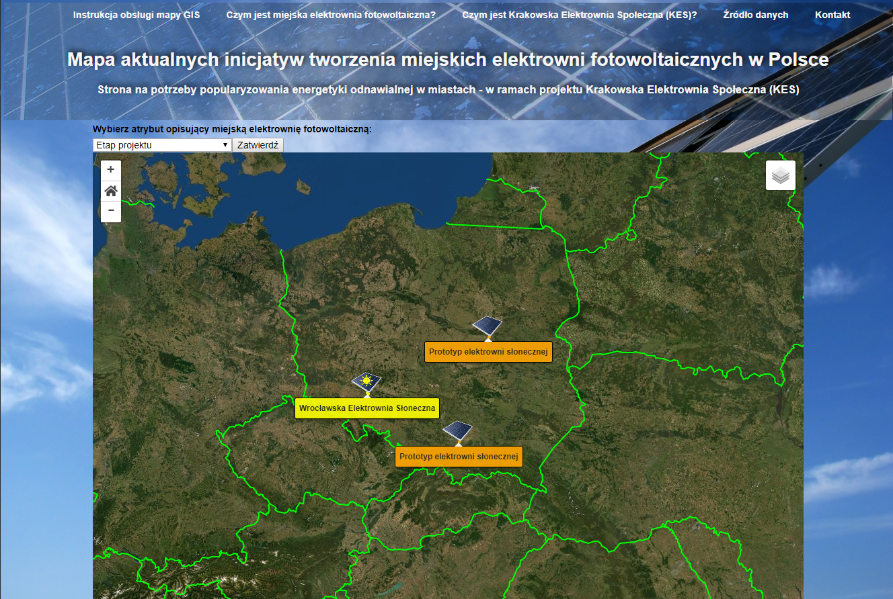

# Solar Poland project - database and GIS map of PV Power Plants in cities

Solar Poland delivers information on urban PV power plants owned by housing co-operatives and their geographical distribution across the country. The web app was created within the scope of Krakowska Elektrownia Społeczna (energy co-operative) project. Applied technologies inlude: QGIS + PostgreSQL/PostGIS + Node.js/Express.js + JavaScript/jQuery + Leaflet.js.

 

The website is available on:
<h3> https://solar-poland.herokuapp.com/map</h3> 

## Descritpion and application 

This is a development version of the project.

The project Solar Poland, comprising a website with an interactive GIS Map, is created for Krakowska Elektrownia Społeczna (KES) organization and to some extent is a continuation of my previous project: Climate KIC Solar Belgrade (https://github.com/GeoFenix/my-website-Solar-Belgrade-database-and-GIS-map ). KES is an energy co-operative based in Kraków, Poland which aim is to invest in and develop photovoltaic power plants in in the urban space and roofs as well as educate community on distributed renewable energy. Solar Poland presents an information on PV power plants owned by housing co-operatives and their geographical distribution across Poland. The application itself is based on web GIS solutions. A PostgreSQL/PostGIS spatial database is kept updated with new data retrieved from the internet search. This data is digitilized to polygons of the buildings in QGIS, using OpenStreerMap and satellite imagery basemaps. Data are displayed on-line through Node.js/Express.js + Leaflet.js map application. Detailed explanation on the database content and instruction how to use a GIS map is given on the website. 

Example from the instruction for GIS map users.


## Applied solutions and examples of code

Solar Poland web application is mainy based on the solutions and source code presented in the web map workshop "Use NodeJS to create a Basic Database API" (http://duspviz.mit.edu/web-map-workshop/leaflet_nodejs_postgis/). Following the workshop's guidelines Solar Polad app consists of:
1) a PostgreSQL/PostGIS database storing spatial data of PV power plants  
2) Node.js server that runs server-side JavaScript and allows for passing variables and data in GeoJSON format from the client to the server and back again 
3) views and routes being components of Express.js framework 
4) a Leaflet.js web map displaying GeoJSON data, viewed on the client side
5) HTML code which is stored in views; these are created using Pug template engine
6) CSS code whis is stored in stylesheets; it is mostly customized, only partially using Bootstrap
7) several addtional code resources are also used - all with a reference to a source code and authors 


## 1) PostgreSQL/PostGIS database and 2) Node.js server

Example of SQL query to a database from :open_file_folder: routes/index.html
```
var solar_plants_query = "SELECT row_to_json(fc) FROM ( SELECT 'FeatureCollection' As type, array_to_json(array_agg(f)) As features FROM (SELECT 'Feature' As type, ST_AsGeoJSON(lg.geom)::json As geometry, row_to_json((id, nazwa, rodz_sp, miasto, rok_odd, adres, ile_inst, rodz_inst, moc_cal, ener_rok, koszty, realizat, co2_red, info)) As properties FROM elektrownie_test As lg) As f) As fc";

 var client = new Client(dbCredentials);
    client.connect(); // connect to the client
    var query = client.query(new Query(solar_plants_query)); // Run our Query
    query.on("row", function (row, result) {
        result.addRow(row);
    });
``` 
A piece of returned GeoJSON data containing Solar Power Plants geometry and attributes
``` 
{
  "type": "FeatureCollection",
  "features": [
    {
      "type": "Feature",
      "geometry": {
        "type": "MultiPolygon",
        "coordinates": [
          [
            [
              [
                20.0083606913588,
                50.0776792962248
              ],
              [
                20.008579793836,
                50.0776324266437
              ],
              [
                20.0084885011372,
                50.0774478772228
              ],
              [
                20.008264834025,
                50.0774976763428
              ],
              [
                20.0083606913588,
                50.0776792962248
              ]
            ]
          ]
        ]
      },
      "properties": {
        "f1": 1,
        "f2": "Prototyp elektrowni słonecznej",
        "f3": "Spółdzielnia Mieszkaniowa \"Czyżyny\"",
        "f4": "Kraków",
        "f5": "przed 2019.07",
        "f6": "blok nr 7 na osiedlu 2. Pułku Lotniczego",
        "f7": "Pilotaż: 54 panele fotowoltaiczne na jednym budynku",
        "f8": null,
        "f9": "15 kWp",
        "f10": null,
        "f11": null,
        "f12": null,
        "f13": null,
        "f14": "http://krakow.wyborcza.pl/krakow/7,44425,24953439,prad-z-dachu-spoldzielnia-zamontowala-54-panele-fotowoltaiczne.html"
      }
    },
``` 
## 3) views and routes being components of Express.js framework

Example of code from :open_file_folder: routes/index.html showing what happens when server is asked about '/map' route. There are some specified queries to the database and the returned GeoJSON data is passed to the view 'public.pug'.
``` 
router.get('/map*', function(req, res) {
    var name;
    if (req.query.name) {
        name = req.query.name;
    } else {
        name = 'f2';
    }

    //Here is some more code on the way, but not included in this display

	var query2 = client.query(new Query(country_lines_query)); // Run our Query
	query2.on("row", function (row, result) {
		result.addRow(row);
	});
	// Pass the result to the map page
	query2.on("end", function (result) {
		var dataCountryLines = result.rows[0].row_to_json // Save the JSON as variable data
		res.render('public', {
			title: "Solar Poland", // Give a title to our page
			jsonDataSolarPowerPlants: dataSolarPowerPlants,
			jsonDataCountryLines: dataCountryLines, // Pass data to the View
			attributeParameter: { attribute: name }
		});
	});
});
```
## 4) a Leaflet.js webmap displaying GeoJSON data, viewed on the client side

In a rendered view GeoJSON data are assign to variables in :open_file_folder: views/map.pug. This file is, in turn, included in public.pug, which in my app it is an equivalent of standard 'index.html'. 
```
script.
    // - Passing variables from backend
    var solarPowerPlants = !{JSON.stringify(jsonDataSolarPowerPlants)};
    var countryLines = !{JSON.stringify(jsonDataCountryLines)};
    var attributeParameter = !{JSON.stringify(attributeParameter)}
script(src="javascripts/map.js") 
```  
The whole Leaflet magic takes place in :open_file_folder: public/javascripts/map.js
The central function generationg our map is makeMap():
```
makeMap(solarPowerPlants, countryLines, currentCategory);
//LEAFLET MAP GENERATION
function makeMap(solarPowerPlants, countryLines, currentCategory) {
    // 1. Create main map element with settings
    var map = L.map('map', { center: [51.213728, 19.661492], zoom: 6, zoomControl: false});

    // 2. Adding tile layers
    // 2a) OpenStreetMap 
    var openStreetTile = L.tileLayer('http://{s}.tile.osm.org/{z}/{x}/{y}.png', {attribution: '© OpenStreetMap'}).addTo(map);
    // 2a) WorldImageryTile (ArcGIS) 
    var mapLink = '<a href="http://www.esri.com/">Esri</a>';
    var wholink = 'i-cubed, USDA, USGS, AEX, GeoEye, Getmapping, Aerogrid, IGN, IGP, UPR-EGP, DigitalGlobe, FSA, Swisstopo and the GIS User Community';
    var worldImageryTile = L.tileLayer('http://server.arcgisonline.com/ArcGIS/rest/services/World_Imagery/MapServer/tile/{z}/{y}/{x}', {attribution: '&copy; '+ mapLink +', '+ wholink, maxZoom: 18}).addTo(map);   
    //AND SO ON...
```
Within this function we add Solar Power Plants GeoJSOn data and define its methods and properties:
```
var solarPowerPlants = L.geoJson(solarPowerPlants, {
        onEachFeature: function(feature, layer) {
            
            // Adding popups with attributes to layer's polygons
            var customOptions = {
                className : 'custom'
            }
            var properties = feature.properties
            var table = addPopUpTable(properties)[0];
            layer.bindPopup(table, customOptions);
            
            //Adding marker to a layer
            var markerInCenter = addMarkerToSolarPowerPlant(feature, layer, currentCategory);

            //Assigning zooming function to marker
            markerInCenter.on('click', onClickZoomToSolarPowerPlant);
            //Callback Function 
            function onClickZoomToSolarPowerPlant(e) {
                // Setting boundary for polygons
                var layerCoordinates = feature.geometry.coordinates;
                var featureBounds = L.latLngBounds(layerCoordinates);
                // We need to swap coordinates, geojson (easting, northing), leaflet (northing, easting)
                var northEastLatitude = featureBounds._northEast.lat;
                var northEastLongitude = featureBounds._northEast.lng;
                var southWestLatitude = featureBounds._southWest.lat;
                var southWestLongitude = featureBounds._southWest.lng;
                var boundCoordinates = [[northEastLongitude, northEastLatitude],[southWestLongitude, southWestLatitude]];
                map.fitBounds(boundCoordinates);
            };
            
        },
        style: styleForSolarPowerPlants

    }).addTo(map);
```
Most of the additional functions, which can be found at the end of this js file, are my own inventions or are modified version of code from Leaflet manual or solutions found in the internet.
```
//ADDITIONAL FUNCTIONS FOR LEAFLET MAP GENERATION

    //Function addPopUpTable
    function addPopUpTable(properties) {
    var $table = $('<table class="for-attributes">');

	var headers = ['Id', 'Etap projektu', 'Rodzaj spółdzielni', 'Miasto', 'Rok oddania do użytku', 'Adres', 'Ilość instalacji', 'Rodzaj instalacji', 'Moc całkowita instalacji', 'Produkcja energii na rok', 'Koszty', 'Realizator', 'Prognozowana redukcja CO2 (na rok?)', 'Info URL']
	var thBox = [];
	$(headers).each(function(index, element) {
		var $th = $('<th>');
		$th.text(element)
		thBox.push($th)
	})

	var tdBox = [];
	var propertiesKeys = Object.keys(properties);
	var propertiesLength = propertiesKeys.length;
	for (var value in properties) {
		var $td = $('<td>');
		if (value === 'f' + propertiesLength) {
			var a = $('<a href="' + properties[value] + '" target="_blank">' + properties[value] + '</a>');
			$td.append(a[0]);
		} else {
			$td.text(properties[value])
		}
		tdBox.push($td)
	};

	$(headers).each(function(index, element) {
		var $tableRow = $('<tr>');
		$tableRow.append(thBox[index]);
		$tableRow.append(tdBox[index]);
		$table.append($tableRow);
	})

return $table;
}
```
## 5) HTML code which is stored in views; these are created using Pug template engine

Beside Leaflet map there is also some wrapping HTML code in the app. 
Pug template engine operates with specified blocks and makes view files well-organised: Example from :open_file_folder: views/public.pug 
```
extends layout
block header
    include _components/header.pug
block content
    include map.pug
    include _components/section_pvpowerplants.pug
block footer
    include _components/footer.pug
```
Smaller piece of HTML code like :open_file_folder: views/_components/header.pug can be added using 'include' function. 
```
<header class="header--bold">
    <div class="header__nav">
        <nav>
            <ul>
                <li><a href="#instrukcja">Instrukcja obsługi mapy GIS</a></li> 
                <li><a href="#elektrownia-sloneczna">Czym jest miejska elektrownia fotowoltaiczna?</a></li>
                <li><a href="#kes">Czym jest Krakowska Elektrownia Społeczna (KES)?</a></li>
                <li><a href="#zrodlo-danych">Źródło danych</a></li>
                <li><a href="#kontakt">Kontakt</a></li>
            </ul>
        </nav>
    </div>
    <div class="header__title">
        <h1>Mapa aktualnych inicjatyw tworzenia miejskich elektrowni fotowoltaicznych w Polsce</h1>
        <h3>Strona na potrzeby popularyzowania energetyki odnawialnej w miastach - w ramach projektu Krakowska Elektrownia Społeczna (KES)</h3>
    </div>
</header>
```
## 6) CSS code whis is stored in stylesheets; it is mostly customized, only partially using Bootstrap
Working with CSS attributes is the biggest challange for me... thus I keep stylesheets short and simple, having some name conventions and good practice in mind. Example: we have parent class "header":
a) its "style" modification have syntax with '--', e.g. header--bold 
b) its "element" modification have syntax with '__', e.g. header__nav, header__title 
see in :open_file_folder: public/stylesheets/style.css
```
.header--bold {
  font-weight: bold;
  text-align: center;
}

.header__nav {
  width: 100%;
  display: block;
}

.header__title {
  width: 90%;
  padding-bottom: 20px; 
  display: inline-block;
  color: whitesmoke;
  text-shadow: 3px -3px 10px black;
}

```
## 7) several addtional code resources are also used - all with a reference to a source code and authors
And these are:
- function zoomHomeCustomize() in :open_file_folder: public/javascripts/map.js is taken from: https://gis.stackexchange.com/questions/127286/home-button-leaflet-map; to style the control buttons in this function this stylesheet is used: http://maxcdn.bootstrapcdn.com/font-awesome/4.2.0/css/font-awesome.min.css
- for all the functions related to Leaflet I digged through the manual:
https://leafletjs.com/reference-1.5.0.html, 
as well as a wonderful workshop from http://duspviz.mit.edu/web-map-workshop/leaflet-js/ (the same platform as for the backend code workshop). 
Leaflet library was taken from (hosted versions):
https://ajax.googleapis.com/ajax/libs/jquery/3.2.1/jquery.min.js
href="https://unpkg.com/leaflet@1.3.1/dist/leaflet.css
And from (download version):
https://leafletjs.com/download.html
- And last but not least, his majesty Bootstrap (download version):
https://getbootstrap.com/docs/4.3/getting-started/download/


## Further Documentation 

:closed_book: As this is a development version of the project I will expand this description to more detailed documentation along with work progress. 

## How can I support developers? 

:+1: Support me with stars, good advice and keep your fingers crossed for my future in IT :smiley: 

## License 

[MIT](LICENSE.txt) license
<br/> [GNU](LICENSE.txt) license

## Special thanks 

Special thanks to Eric Huntley and Mike Foster from duspviz.mit.edu platform for their webmap workshop: Leaflet with PostGIS, NodeJS, and Express: Use NodeJS to create a Basic Database API (http://duspviz.mit.edu/web-map-workshop/leaflet_nodejs_postgis/)
